<!-- GENERATED by `cargo run -p xtask -- gen-mermaid`. Do not edit by hand. -->
# alint architecture diagrams

These flowcharts are generated from the single LikeC4 architecture model (`docs/design/architecture/model/`) and render natively on GitHub. The same model powers the interactive, themed versions on alint.org:
<https://alint.org/docs/about/architecture-diagrams/>

Regenerate with `cargo run -p xtask -- gen-mermaid` (or `--check` to gate); pinned to likec4 1.58.0.

## System context

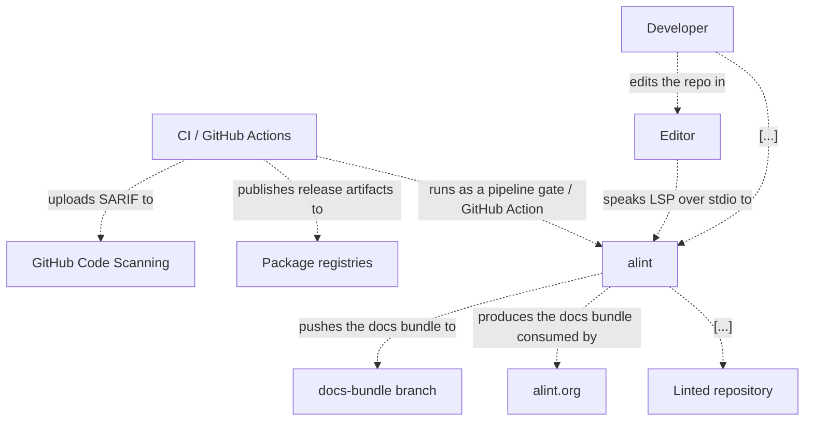

## Containers

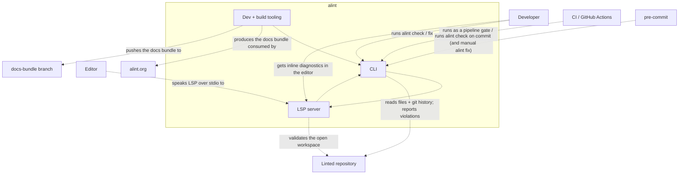

## CLI components

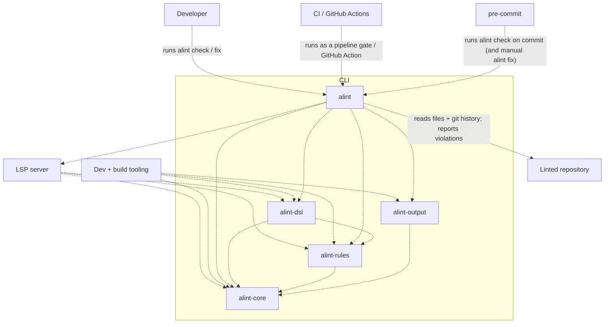

## Crate dependency graph

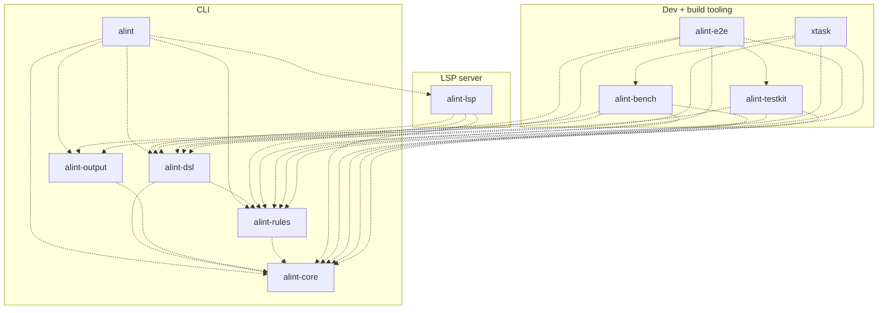

## Execution pipeline

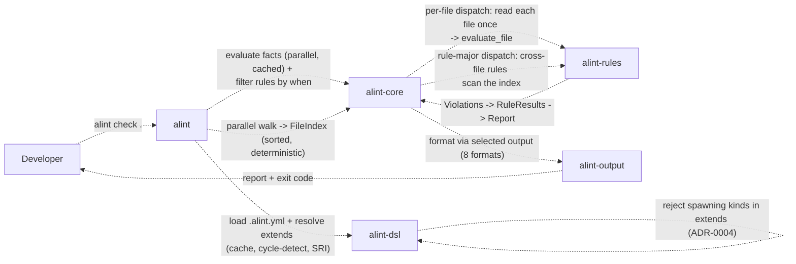

## Config load and the extends trust boundary

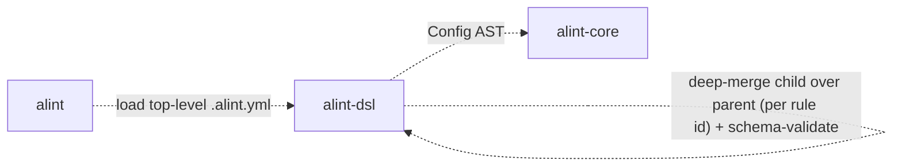

## Dispatch and read-coalescing

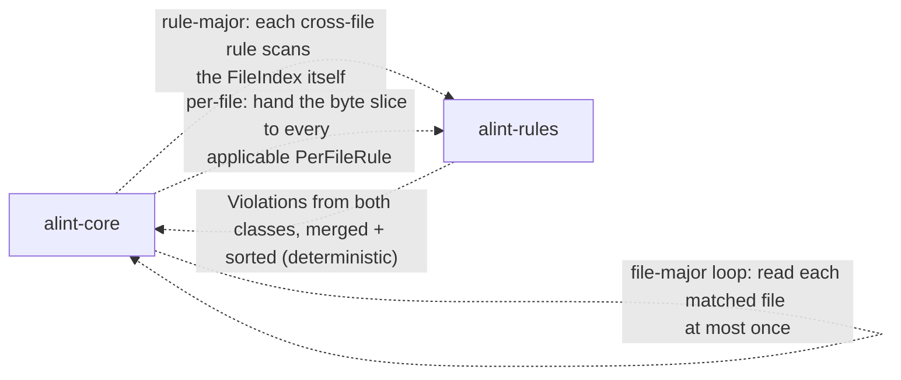

## Rule catalogue

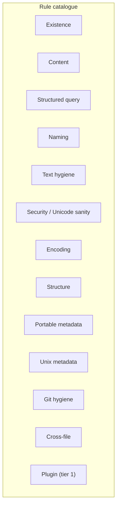

## Config DSL domain model

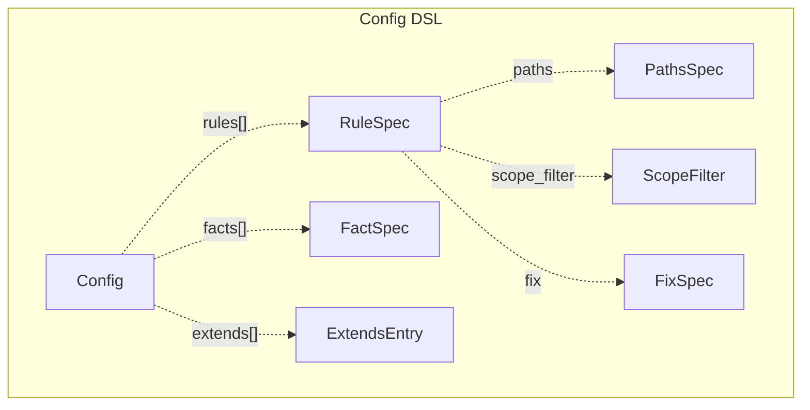

## Rule execution type model

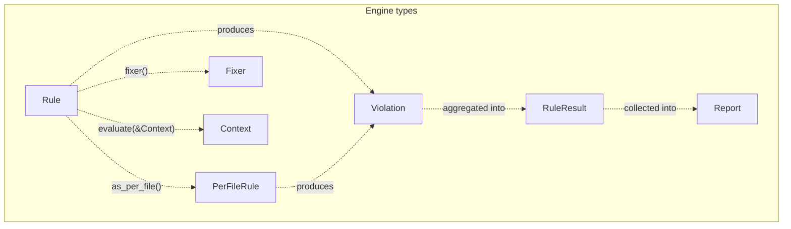

## Facts and conditional rules

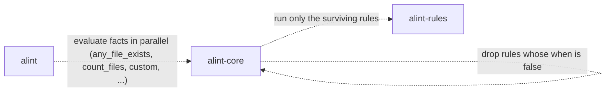

## Fix flow

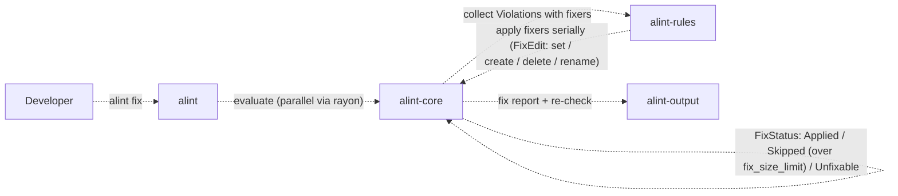

## Walk, gitignore, and filtering

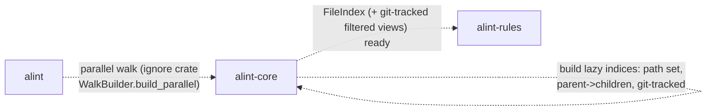

## Template expansion

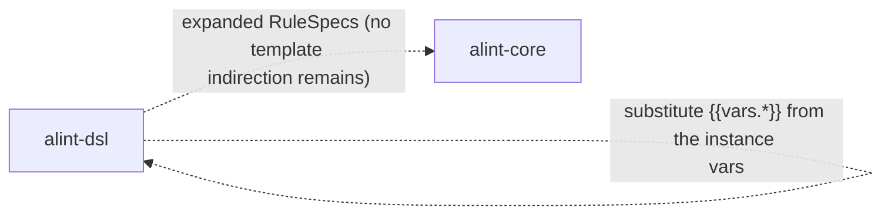

## Monorepo nesting and scoping

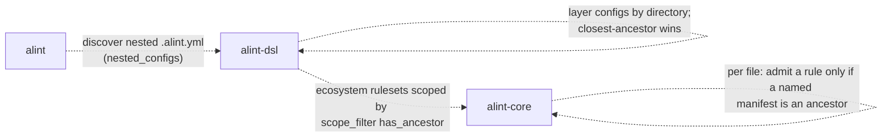

## Output formats


## LSP

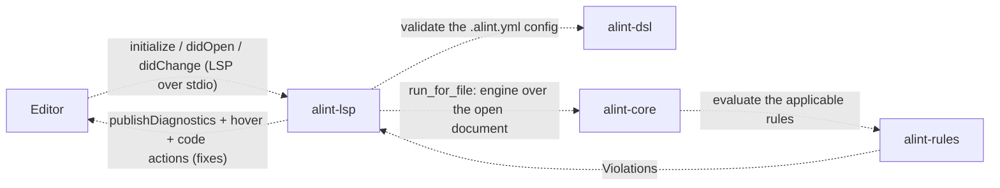

## Editor integrations

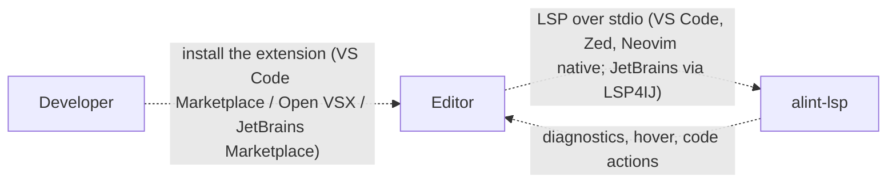

## CI: GitHub Action and SARIF

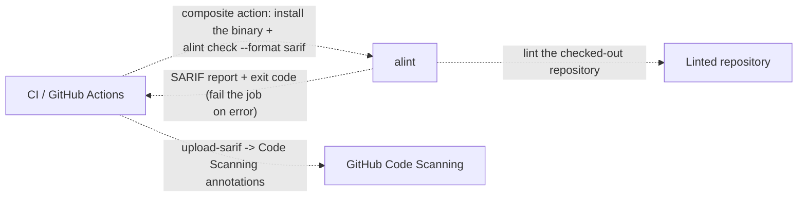

## pre-commit: the commit gate

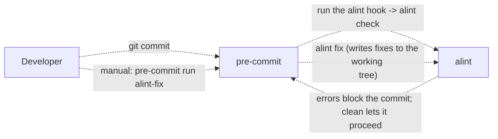

## Release and distribution

```mermaid
graph LR
  Dev["Developer"]
  Ci["CI / GitHub Actions"]
  Registries["Package registries"]
  AlintCliAlintBin["alint"]
  Dev -. "`tag vX.Y.Z`" .-> Ci
  Ci -. "`build the per-OS/arch release matrix`" .-> Ci
  Ci -. "`publish to crates.io / npm / Homebrew / 
ghcr.io / GitHub releases`" .-> Registries
  Dev -. "`install via install.sh / cargo / brew / 
npx / docker`" .-> AlintCliAlintBin
```

## Contributing a rule kind

```mermaid
graph LR
  Dev["Developer"]
  AlintCliRules["alint-rules"]
  AlintCliDsl["alint-dsl"]
  AlintToolingXtask["xtask"]
  Dev -. "`impl Rule / PerFileRule in alint-rules + 
register_builtin`" .-> AlintCliRules
  Dev -. "`add to all_kinds.yaml + document in 
docs/rules.md`" .-> AlintCliDsl
  Dev -. "`gen-schema (Options -> JSON schema) + 
gen-facts + gen-model`" .-> AlintToolingXtask
  AlintToolingXtask -. "`gen-* --check gates fail until 
schema/facts/arch/model are fresh`" .-> AlintToolingXtask
  Dev -. "`unit + snapshot tests (alint-testkit)`" .-> AlintCliRules
```

## Docs as code and drift gates

```mermaid
graph LR
  AlintToolingXtask["xtask"]
  Docsbundle["docs-bundle branch"]
  Site["alint.org"]
  AlintToolingXtask -. "`gen-schema / gen-facts / gen-arch / 
gen-model --check (CI freshness gates)`" .-> AlintToolingXtask
  AlintToolingXtask -. "`docs-export builds + pushes the bundle`" .-> Docsbundle
  Docsbundle -. "`Cloudflare deploy hook -> alint.org 
rebuild`" .-> Site
  Site -. "`sync-from-alint + internal-link / claim 
/ meta-description gates`" .-> Site
```

## Deterministic performance gating

```mermaid
graph LR
  Ci["CI / GitHub Actions"]
  AlintToolingBench["alint-bench"]
  Ci -. "`cargo bench (criterion) on a seeded tree`" .-> AlintToolingBench
  AlintToolingBench -. "`gungraun det_engine / det_check under 
Valgrind (callgrind Ir)`" .-> AlintToolingBench
  AlintToolingBench -. "`instruction-count deltas (load-immune)`" .-> Ci
  Ci -. "`advisory perf-gate job flags regressions 
on the SHA`" .-> Ci
```

## Plugin model

```mermaid
graph LR
  AlintCliCore["alint-core"]
  AlintCliRules["alint-rules"]
  AlintCliCore -. "`dispatch the command rule per matched 
file`" .-> AlintCliRules
  AlintCliRules -. "`spawn external checker (env: path, rule 
id, level, vars, facts)`" .-> AlintCliRules
  AlintCliRules -. "`exit code = verdict; stdout/stderr = 
message -> Violation`" .-> AlintCliCore
  AlintCliCore -. "`roadmap v0.13: WASM / WIT plugin host 
(sandboxed, no network by default)`" .-> AlintCliCore
```

## Security: path confinement and spawning-kind gating

```mermaid
graph LR
  AlintCliDsl["alint-dsl"]
  AlintCliCore["alint-core"]
  AlintCliDsl -. "`reject SPAWNING_RULE_KINDS (command / 
generated_file_fresh / 
command_idempotent) in extends 
(ADR-0004)`" .-> AlintCliDsl
  AlintCliDsl -. "`reject allow_out_of_root + custom facts 
outside the top-level config`" .-> AlintCliDsl
  AlintCliCore -. "`walker prunes symlinks that escape the 
repo root`" .-> AlintCliCore
  AlintCliCore -. "`git-backed rules sanitize the since: 
range (no argument injection)`" .-> AlintCliCore
```

## Security: Trojan-source and unicode hygiene

```mermaid
graph LR
  AlintCliCore["alint-core"]
  AlintCliRules["alint-rules"]
  AlintCliCore -. "`per-file scan: no_bidi_controls / 
no_zero_width_chars / no_bom`" .-> AlintCliRules
  AlintCliRules -. "`flag bidi overrides, zero-width chars, 
BOM, conflict markers`" .-> AlintCliRules
  AlintCliRules -. "`Violations (+ fixers: strip bidi / 
zero-width / BOM)`" .-> AlintCliCore
```
