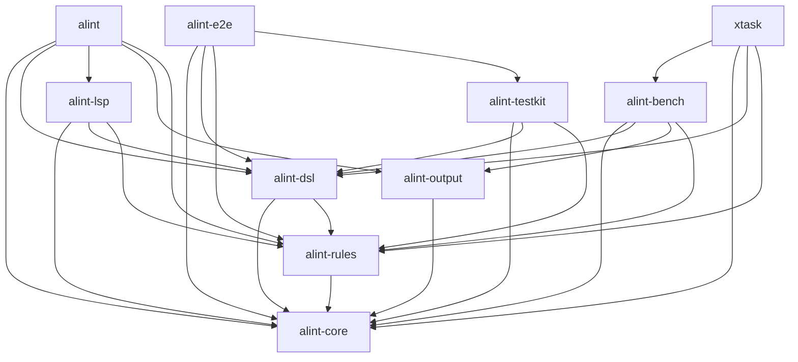

# Crate dependency graph

<!-- GENERATED by `cargo run -p xtask -- gen-arch`. Do not edit by hand.
     Edit the crates' Cargo.toml and regenerate; `gen-arch --check` gates it. -->

The intra-workspace dependency edges of alint's Cargo workspace, extracted from
`cargo metadata`. `alint-core` is the foundation (no workspace dependencies); the
`alint` binary and `xtask` sit at the top. An edge `A --> B` means crate A depends
on crate B.

## Crates by tier

Tier = longest dependency chain to the foundation (`alint-core` = 0).

| Tier | Crate | Role |
|---|---|---|
| 0 | `alint-core` | Core types and execution engine for the alint language-agnostic repository linter. |
| 1 | `alint-output` | Internal: output formatters for alint reports (human, json, ...). Not a stable public API. |
| 1 | `alint-rules` | Internal: built-in rule implementations for alint. Not a stable public API. |
| 2 | `alint-dsl` | Internal: YAML DSL loader for alint configuration files. Not a stable public API. |
| 3 | `alint-bench` | Benchmark harness and deterministic fixture generator for alint |
| 3 | `alint-lsp` | Internal: Language Server Protocol server for alint. Not a stable public API. |
| 3 | `alint-testkit` | Internal: end-to-end scenario fixtures + tree-spec utilities for alint's own tests. Not a stable public API. |
| 4 | `alint` | Language-agnostic linter for repository structure, file existence, filename conventions, and file content rules. |
| 4 | `alint-e2e` | Internal: end-to-end scenario tests for alint. Not a library. |
| 4 | `xtask` | Cargo-xtask helpers for alint (bench, release, etc.) |
